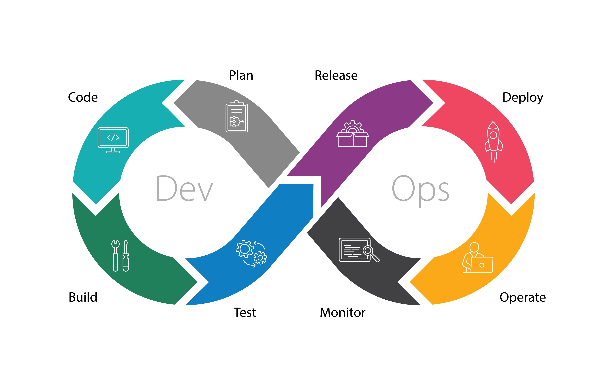

# 1. Devops

## 1.1 Introduction

Devops is a collaborative approach to software development and IT operations that aims to shorten the system development lifecylce while deilvering features, updates, and fixes frequently. 

DevOps is a set of practices that combines software development (Dev) and IT operations (Ops). The goal is to shorten the systems development lifecycle and provide continuous delivery with high software quality. 

Devops is not a technology or a tool, but a culture and a philosophy that encourages collaboration, communication, and integration between development and operations teams.

> **DevOps = Development + Operations**

Traditionally the development and deployment teams were seperate. Developers would develop the software and then hand it over to the deployment team who will deploy and monitor the software. This led to delays and other issues which often ended up in a slowe process.

Devops breaks these barriers by enforcing a shared responsibility and continous feedback throught the software development lifecycle.

## 1.2 Why Devops

> **Advantages**
- Faster delivery of software
- Increased collboration between teams
- Automate repetitive tasks
- Continous improvement via feedback

## **2. DevOps Principles and Culture**

#### **2.1 Core Principles**

1. **Collaboration & Communication**
   Break down silos between development, QA, and operations.

2. **End-to-End Responsibility**
   Teams own the product from design to deployment and maintenance.

3. **Continuous Improvement**
   Feedback loops, retrospectives, and process optimization.

4. **Automation**
   Automate builds, tests, deployments, and monitoring.

5. **Customer-Centric Action**
   Deliver value based on customer needs and feedback.

#### **2.2 DevOps Culture**

* **Shared responsibility** for quality and delivery
* **Blameless postmortems** after failures
* **Empowerment** — teams have autonomy to make decisions
* **Learning-focused** — failure is seen as an opportunity to improve
* **Transparency** — open sharing of data, progress, and metrics

### **3. Key Concepts in DevOps and Its Importance in Software Development**

#### **3.1 Key Concepts**

* **CI/CD (Continuous Integration & Continuous Delivery/Deployment)**
  Ensures code changes are tested, integrated, and deployed automatically.

* **Infrastructure as Code (IaC)**
  Managing infrastructure through code (e.g., Terraform, Ansible).

* **Monitoring & Logging**
  Collecting metrics, logs, and traces for visibility and troubleshooting.

* **Microservices Architecture**
  Small, independent services that are easier to deploy and scale.

* **Version Control**
  Git for tracking changes to code and configuration.

* **Security in DevOps (DevSecOps)**
  Embedding security practices into the DevOps workflow.

#### **3.2 Importance in Software Development**

* **Faster Time to Market** — quicker delivery of features and fixes.
* **Higher Quality** — automated testing and continuous feedback.
* **Scalability** — infrastructure can be managed and scaled automatically.
* **Resilience** — failures can be detected and fixed quickly.
* **Cost Efficiency** — automation reduces manual effort.

### **4. Lifecycle of DevOps and the Importance of Automation**

#### **4.1 DevOps Lifecycle Stages**

1. **Plan**

   * Define business requirements, features, and priorities.
   * Tools: Jira, Trello, Azure Boards.

2. **Code**

   * Develop features in small increments.
   * Tools: Git, GitHub, GitLab.

3. **Build**

   * Compile source code into binaries.
   * Tools: Maven, Gradle.

4. **Test**

   * Automated unit, integration, and functional testing.
   * Tools: JUnit, Selenium, Cypress.

5. **Release**

   * Prepare and approve deployment packages.
   * Tools: Jenkins, GitLab CI/CD.

6. **Deploy**

   * Automated deployment to staging/production environments.
   * Tools: Kubernetes, Docker.

7. **Operate**

   * Manage infrastructure, services, and application availability.
   * Tools: AWS, Azure, GCP.

8. **Monitor**

   * Observe application health and performance.
   * Tools: Prometheus, Grafana, ELK Stack.

> **Note:** These stages are continuous and interconnected.

#### **4.2 Importance of Automation**

* **Consistency** — same process every time, reducing human error.
* **Speed** — faster builds, tests, and deployments.
* **Reliability** — automated rollbacks and failover.
* **Scalability** — handle increased workload without extra manual effort.
* **Cost Reduction** — fewer manual interventions.

Automation spans:

* Build pipelines
* Testing
* Deployment
* Monitoring & alerts
* Security scans

---

### **5. References**

1. Humble, J., & Farley, D. (2010). *Continuous Delivery: Reliable Software Releases through Build, Test, and Deployment Automation*. Addison-Wesley.
2. Kim, G., Humble, J., Debois, P., & Willis, J. (2016). *The DevOps Handbook*. IT Revolution Press.
3. Bass, L., Weber, I., & Zhu, L. (2015). *DevOps: A Software Architect’s Perspective*. Addison-Wesley.
4. Atlassian. *What is DevOps?* – [https://www.atlassian.com/devops](https://www.atlassian.com/devops)
5. Microsoft Azure Docs – *DevOps Lifecycle* – [https://learn.microsoft.com/en-us/devops](https://learn.microsoft.com/en-us/devops)
6. AWS DevOps Blog – [https://aws.amazon.com/devops/](https://aws.amazon.com/devops/)
